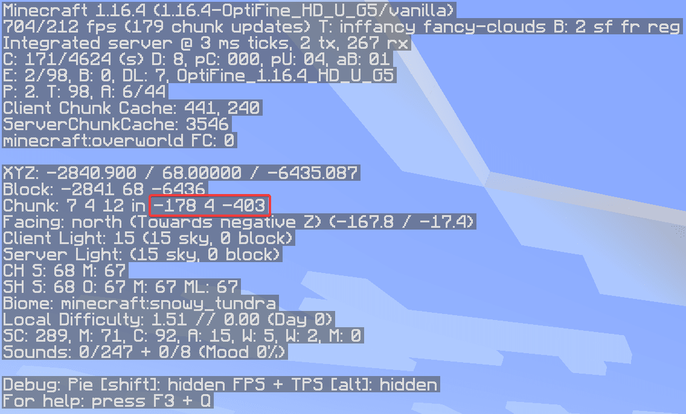

# AscendNations
AscendNations - The Ascendancy Project's nations plugin developed by [Froogo](https://froogo.co.uk).

### Index
- [Installation](#installation)
    - [ProtocolLib](#protocollib)
- [Languages](#languages)
    - [Language country codes](#language-country-codes)
    - [Default language](#default-language)
    - [Language map](#language-map)
        - [Language name](#language-name)
        - [Commands](#commands)
        - [Lines](#lines)
- [Nation variables](#nation-variables)
    - [Values](#values)
- [Formulas](#formulas)
    - [Nation member power](#nation-member-power)
    - [Nation rift power](#nation-rift-power)
    - [Nation power](#nation-power)
    - [Claim threshold](#claim-threshold)
    - [Existence threshold](#existence-threshold)
- [Rifts](#rifts)
    - [Rift power](#rift-power)
    - [Rift chunks](#rift-chunks)
    - [Example](#example)

## Installation
Download the [latest version of the plugin here](../../releases/latest) and add it to the plugins directory.

### ProtocolLib
Download `v4.6.0-SNAPSHOT` of ProtocolLib, and add it to the plugins directory.

You can [find the downloads for ProtocolLib here](https://ci.dmulloy2.net/job/ProtocolLib/).

## Languages
This section relates to the `languages.json` configuration file.
[View the default state of `languages.json`.](src/main/resources/languages.json)

### Language country codes
The languages are indexed by their two-letter country code given in Minecraft.
I believe these are the country codes defined in [ISO 639-1](https://en.wikipedia.org/wiki/List_of_ISO_639-1_codes),
though Minecraft doesn't seem to have published any information verifying this.

For example: English is `en`, Dutch (Nederlands) is `nl`, and German (Deutsch) is `de`.

### Default language
The `defaultLanguage` field specifies the country code of the fallback language.

The default language will be utilised if a player's locale is not recognised,
a line is missing in a player's language, or for certain global lines.
An example of a global line is the default messages for a nation, these will **always** utilise the default language,
as to not confuse players.

### Language map
The `languages` field is a map of all languages.
The key of this map is the language's country code, and the value is a Language.

#### Language name
The language name is the name displayed in the `/language` command.
This field is **necessary**.

#### Commands
The `commands` field specifies all of the subcommands under the `/nation` command.
This field is **necessary**, and all commands **must** be provided,
otherwise players using this language will not be able to see nor utilise the commands.

#### Lines
The `lines` field specifies messages sent by the server to players, including broadcasts, and item names.
This field is **necessary**, but the values are only **optional**,
if a line is not provided, it will fall back to [the default language](#default-language).

Some lines are global, such as nation messages, [the default language](#default-language)'s lines will only be utilised for these.

## Nation variables
This section relates to the `nationvariables.json` configuration file.
[View the default state of `nationvariables.json`.](src/main/resources/nationvariables.json)

The majority of values in this configuration file, are used in [the formulas](#formulas).

### Values

Field | Description
----- | -----------
`maxNationPop`                           | the maximum amount of members allowed in a nation.  
`maxMemberPassivePower`                  | formula variable.  
`maxMemberBonusPower`                    | formula variable.  
`riftModifier`                           | formula variable.  
`minNationPopClaimRift`                  | formula variable.  
`memberPassivePowerStart`                | the amount of passive power a player gains when first joining the server.  
`memberPassiveGainFrequency`             | the amount of ticks between each increment of a player's passive power due to being online.  
`memberPassiveDecayFrequency`            | the amount of ticks between each decrement of a player's passive power due to being offline.
`memberPowerLostOnDeath`                 | the amount of power a player loses upon dying.  
`claimThresholdOnePlayer`                | formula variable.  
`claimThresholdSmallModifier`            | formula variable.  
`claimThresholdSmallOffset`              | formula variable.  
`claimThresholdLargeModifier`            | formula variable.  
`existenceThresholdOnePlayer`            | formula variable.  
`existenceThresholdSmallModifier`        | formula variable.  
`existenceThresholdSmallOffset`          | formula variable.  
`existenceThresholdLargeModifierDynamic` | formula variable.  
`existenceThresholdLargeModifierFlat`    | formula variable.  
`chunksPerMember`                        | the amount of chunks a nation can claim per member, can be a non-integer value; always rounded down.  
`outpostsPerMember`                      | the amount of outposts a nation can claim per member, can be a non-integer value; always rounded down.  
`claimBlockHomeType`                     | the material of the home claim block.  
`claimBlockOutpostType`                  | the material of the outpost claim block.  
`lockoutDuration`                        | the time in milliseconds a nation's power lockout lasts.  
`lockoutFactor`                          | the amount of chunks overclaimable when a nation exits lockout; calculated as `chunksClaimable` / `lockoutFactor`.
`lockoutChunkDuration`                   | the time in milliseconds a nation's chunk/outpost lockout lasts.  
`lockoutReminderFrequency`               | the amount of ticks between each lockout reminder.  
`claimPunishmentDuration`                | the time in milliseconds a nation cannot claim after an automatic reclaim.  
`overclaimDuration`                      | the time in milliseconds an overclaim takes.  
`overclaimDurationOutpost`               | the time in milliseconds an outpost overclaim takes.  
`overclaimDurationHome`                  | the time in milliseconds a home overclaim (nation destruction) takes.  
`resupplySatisfiedDuration`              | the time in milliseconds an outpost's supply is satisfied for  
`resupplyTimeout`                        | the time in milliseconds before a resupply will timeout, and the outpost will be lost.  
`resupplyDistance`                       | the Euclidean distance a minecart must be within the outpost before an outpost is considered satisfied.  
`resupplyHealth`                         | the amount of health a resupply minecart has.  
`resupplyReminderFrequency`              | the amount of ticks between each resupply reminder.  
`protectedMobs`                          | the mobs which are invulnerable inside claimed land.  
`exemptMobDamageCause`                   | the mob damage causes which mobs are not protected from.
`protectedBlocks`                        | the blocks which are protected from right-click events inside claimed land.  
`goodSpawnBlocks`                        | blocks which players are able to spawn on top of.
`saveFrequency`                          | the amount of ticks between each autosave of `nations.json`.
`mapBeaconLevitation`                    | the amount of blocks the map beacons are above the floor.
`mapBeaconType`                          | the material of the base of the beacon.
`mapBeaconGlass`                         | the material of the glass on beacons of regular claim chunks.
`mapBeaconGlassHome`                     | the material of the glass on beacons of home claim chunks.
`mapBeaconGlassOutpost`                  | the material of the glass on beacons of outpost claim chunks.
`mapDuration`                            | the time in milliseconds that the map stays active for.
`homePowerCost`                          | the amount of passive power deducted from a player when teleporting home.

## Formulas
This section expects a decent understanding of algebra and functions.
I may also use some non-standard mathematical (instead opting for programming equivalent) symbols,
such as `<=`, for less than or equal to, or `>=` for greater than or equal to, etc.

All variables in formulas wrapped in square brackets [like this], are present in `nationvariables.json`.

### Nation member power
```
power = min(passivePower, [maxMemberPassivePower]) + min(bonusPower, [maxMemberBonusPower])
maxPower = [maxMemberPassivePower] + [maxMemberBonusPower]
```

### Nation rift power
The rift power is the sum of the power of all rifts under that nation's control, or the maximum rift power, whichever is smaller.
```
maxRiftPower = nationPopulation * [riftModifier] - [minNationPopClaimRift] * [riftModifier]
```

### Nation power
The nation power is the sum of all of the power of all members, plus the rift power.

### Claim threshold
```
claimThreshold {nationPopulation = 1} = [claimThresholdOnePlayer]

claimThreshold {1 < nationPopulation < [minNationPopClaimRift]} = [claimThresholdSmallModifier] * nationPopulation - [claimThresholdSmallOffset] 

claimThreshold {[minNationPopClaimRift] <= nationPopulation} = [claimThresholdLargeModifier] * nationPopulation
                    + ([claimThresholdSmallModifier] * [minNationPopClaimRift] - [claimThresholdSmallOffset])
                    - ([claimThresholdLargeModifier] * [minNationPopClaimRift])
```

### Existence threshold
```
existenceThreshold {nationPopulation = 1} = [existenceThresholdOnePlayer]

existenceThreshold {1 < nationPopulation < [minNationPopClaimRift]} = [existenceThresholdSmallModifier] * nationPopulation - [existenceThresholdSmallOffset] 

existenceThreshold {[minNationPopClaimRift] <= nationPopulation} = claimThreshold
                    - ([existenceThresholdLargeModifierDynamic] * pop) + [existenceThresholdLargeModifierFlat]
```

## Rifts
This section relates to the `rifts.json` configuration file.
[View the default state of `rifts.json`.](src/main/resources/rifts.json)

### Rift power
The `power` field determines how much power will be granted to the owner of the rift.

### Rift chunks
The `chunks` field is an array of chunks which the rift is a part of. The `X` and `Z` values are the chunk's co-ordinates (not block).

You can see these co-ordinates in Minecraft's F3 menu.

### Example
Here is an example rift with 5 power, with one chunk, visible in the screenshot.

Screenshot:


JSON:
```json
{
    "power": 5,
    "chunks": [
        {
            "x": -178,
            "z": -403
        }
    ]
}
```
